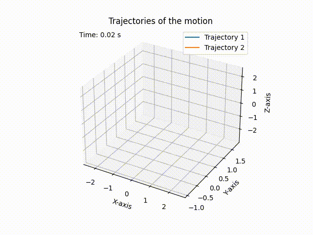

# LMS - Lagrangian Mechanics Simulator

## Overview
The Lagrangian Mechanics Simulator (LMS) is a Python library designed for the simulation of mechanical systems using Lagrangian mechanics. Lagrangian mechanics provides a powerful framework for describing the dynamics of complex systems by expressing them in terms of generalized coordinates, velocities, and potential energy functions.


## Key features
### Modular Constraint Definition
The library introduces a `parametrization` function that allows users to wrap constraint functions, facilitating the definition of constraints within a Lagrangian system. This modularity enables the easy incorporation of various constraints into mechanical simulations.

### Flexible Potential Energy Definition
The library provides a `potential_energy` function that allows users to wrap potential energy functions, offering flexibility in defining energy contributions within a Lagrangian system. Users can easily incorporate gravitational and elastic potential energy functions into their simulations.

### Dynamic System Evolution
The `evolve_lagrangian` function serves as a core component for dynamically evolving Lagrangian systems over specified time spans. This function integrates the equations of motion using the Euler-Lagrange equations, providing users with a predictive tool for simulating the behavior of mechanical systems.


## Example: Simulating a double pendulum with gravitational potential energy
```python
import jax
from jax import numpy as jnp
from src.surfaces import parametrization, double_pendulum
from src.potentials import potential_energy, gravity
from src.lagrangian import evolve_lagrangian
from src.plotting import animate_3D_trajectory

# Set initial conditions and parameters
nbodies = ndim = 2
mass = jax.random.uniform(key, (nbodies,))
q = jax.random.uniform(key, (nbodies, ndim))
q_t = jax.random.uniform(key, (nbodies, ndim))

# Create a constraint with parametrization
constraint = parametrization(double_pendulum, l1=1.0, l2=2.0)

# Create gravitational potential energy
g_pot = potential_energy(gravity, g=9.81)   

# Set time evolution parameters
tmax = 20.
npoints = 500
tspan = jnp.linspace(0., tmax, npoints)

# Evolve the Lagrangian system
positions, velocities = evolve_lagrangian(tspan, q, q_t, mass, potentials=[g_pot], constraint=constraint)

# animate the trajectory
animate_3D_trajectory(tspan, positions, constraint)
```

<p align="center">
  
</p>

## Installation
To use the Lagrangian Mechanics Simulator, you can clone the repository and install the required dependencies:

```bash
git clone https://github.com/lorenzoliuzzo/LMS.git
cd LMS
pip install -r requirements.txt
```

## Contributing
If you want to contribute to the project, you can open a [pull requests](https://github.com/lorenzoliuzzo/LMS/pulls) or use the [issue tracker](https://github.com/lorenzoliuzzo/LMS/issues/) to suggest any code implementations or report bugs. 
Any contributions are welcome! 

## License
The code is released under the terms of the [GNU General Public License v3.0](https://www.gnu.org/licenses/gpl-3.0.html), see the [LICENSE](https://github.com/lorenzoliuzzo/LMS/blob/master/LICENSE).
